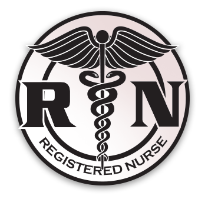

# Nursissimo   

## Collaborative project

Nursissimo is a software for nurses' offices. It allows the nurses' offices to register patients in the database easily,
to make appointments, and to quickly visualize the different nurses timetable depending on the day. Nursissimo also 
allows nurses to check their daily planning, the different appointments and the tips between these appointments. Moreover,
they also can also report their days off.

*Accès au site web, en fonction du déploiement*

## Installation

**1**. Install the Python `virtualenv` package:

`pip install virtualenv`

**2**. Download the project directory. Once the files unzipped/downloaded, create a python virtual environment in the said 
directory:

`cd /project_directory`

`virtualenv venv`

Linux / MacOS: `source venv/bin/activate`

Windows: `.\venv\Scripts\activate.bat`

**3**. From the same directory, install the app and its dependencies:

`pip install -e nursissimo/`

## Running Nursissimo

**1**. Go to your virtualenv. Add the app to your environment variables:

Linux / MacOS : 

Windows : 

**2**. Run the app:

**Authentification**

You can log in with an administrator account. Depending on your office, select the *As Admin* mode and fill in the identifiers : 

Doctissimo office

`username: doctissimo@hotmail.fr`

`password : password`

Malakoff office

`username : malakoff@gmail.com`

`password : password`

You can also log in with a nurse account corresponding to the initial database. The following profiles have been initialized :

Doctissimo office

`username : laurent.cabaret@hotmail.fr`

`username : jpp@hotmail.fr`

`username : celine.hudelot@hotmail.fr`

`username : jeanmarie.detriche@hotmail.fr`

Malakoff office

`username : pierre.dupont@hotmail.fr`

The passwords are initialized to `password`

**Administrator view**

**Nurse view**

**Our strength**

Our software use a specific optimizer to determine the different appointments of a nurse in a day. Its goal is to minimize
the transport time of a nurse. It allows the largest number of appointments to a nurse in a reduced geographic area around
the nurse office. Then he gives the best way for every nurse to go the appointments, minimizing the tips time. If it is
possible, our optimizer favors walking rather than driving.

 
