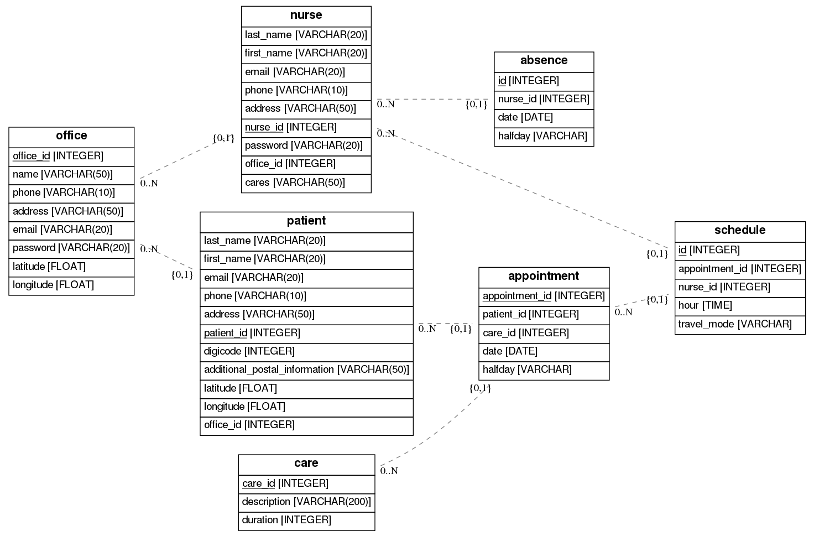

# Nursissimo 

### Atelier Développement Logiciel - Gestion de tournée des infirmiers - 2018-2019

*Louis Cassedanne, Maxime Dieudonné, Charles de la Roche, Hippolyte Lévêque,  Alix Mallard, Romain Pascual*

 

# 1. Description du projet

## Enjeux sous-jacents

Les cabinets d'infirmiers ont un fonctionnement très spécifique à leur activité qui consiste en une répartition des soins à effectuer chez les patients au sein de toute l'équipe. Si celle-ci est mal faite, cela peut conduire à une perte considérable de temps / d'argent, et donc d'efficacité. Plus encore, cela peut contraindre le cabinet à refuser des rendez-vous à certaines dates si les interventions des infirmiers ne sont pas optimisées.
En particulier, les trajets effectués par les infirmiers sont évidemment la première source potentielle de perte de temps : Il paraît inconcevable qu'un infirmier ait à effectuer un soin au nord de la région parisienne chez un patient A, et le suivant tout au sud alors que certains de ses collègues iront en même temps réaliser des soins à proximité du patient A.

## Notre solution

La solution que nous proposons se veut simple et efficace, sous la forme d'une application web:
- Celle-ci permet au compte administrateur du cabinet de:
  - Créer des comptes infirmiers
  - Créer des comptes patients
  - Gagner du temps graĉe à une interface spécialement pensée pour la prise de rendez-vous par téléphone.
- Pour les infirmiers, l'interface permet de:
  - Modifier ses informations personnelles et professionnelles (prise en charge de soins, demande de congés)
  - Visualiser son parcours de la prochaine journée (24 heures avant le début de celle-ci)
- Le tout est géré par un optimiseur qui prend en compte tous les rendez-vous d'une demi-journée (Voir section 3.1 pour la description complète)

## Les améliorations

Voici les pistes d'améliorations prioritaires pour une v2 du projet:
- Notre optimiseur devrait être capable de prendre en compte des rendez-vous à des horaires fixes. Si un patient doit recevoir un soin toutes les semaines, le même jour à la même heure, nous ne pouvons pas nous permettre de lui assurer seulement que son soin aura lieu à un moment dans la demi-journée (pour des raisons médicales évidentes).
- A l'heure actuelle, les compétences professionnelles des infirmiers sont renseignées dans la base de données, mais pas prise en compte dans l'optimisation. Cette contrainte devrait donc également être rajoutée durant le processus d'optimisation dans notre v2.

Nous listons désormais ici les améliorations secondaires (qui permettent essentiellement un meilleur workflow d'utilisation de notre application):
- implémentation d'alertes SMS/mails tant pour les infirmiers que pour les patients, afin de les informer des prochains rendez-vous qui arrivent.
- Possibilité de valider un rendez-vous a posteriori si celui-ci a bien eu lieu, ou de l'invalider dans le cas contraire (contre-temps précisé au même moment par l'infirmier dans l'application)
- Sur un smartphone, notre interface de vue du planning de la journée pour un infirmier pourrait directement lancer l'application "Google Maps" avec le guidage vers la prochaine destination.

 

# 2. Vue d’ensemble de l’architecture

## Architecture globale

Nous avons décidé d'utiliser l'architecture suivante pour notre projet :
- Flask pour le back et le serveur
- SQL Alchemy pour les bases de données
- Bootstrap pour le Front
- AMPL pour la résolution des problèmes linéaires

## Choix du framework Flask

Flask est un microcontroller pour développement Web qui présente de nombreux avantages pour effectuer un projet de développement de logiciel.

##### Minimaliste et simpliste
Flask est très petit. C'est un framework qui n'installe que très peu d'éléments (environ 2000 lignes de codes) et qui s'apprend très rapidement. A l'inverse de Django, la courbe d'apprentissage pour entamer une application est très courte. Il n'y a pas de restrictions et on a une liberté totale d'implémenter ce que l'on veut comme on le veut.
##### Flexible et étendable
Le framework est très flexible et très bien conçu. Même si Flask reste un micro framework et ne peut donc pas tout faire, il est très évolutif et on peut ajouter les fonctionnalités désirées assez facilement. La structure de l'application dépend vraiment de ses choix, il y a uniquement quelques spécifications prédéfinies mais il est facile de les détourner si l'on veut.
##### Système de routage et Blueprints
Le système de routage (dit "routing") est très intuitif sur Flask avec l'utilisation de décorateurs pour définir certaines routes. Les "Blueprints" sont comme des modules pour l'application.
##### Serveur web et debogage
Il est possible d'exécuter le serveur web intégré à Flask et de voir son application fonctionner sans encombres. De surcroît, Flask est livré avec un débogueur intégré au navigateur qui est très utile lorsque l'on développe.
##### Notre organisation
Notre back est organisé sur le principe du MVC : model-view-controller.
Nous avons décidé de séparer notre application en plusieurs blueprints. Chaque blueprint correspond à une route principale à laquelle sont associées de nombreuses sous-routes. L'ensemble de nos fonctions se situent dans le controller associé au blueprint. Nos modèles sont définis à l'aide d'une ORM présentée ci-dessous. L'ensemble des "views" associés à nos routes se trouvent dans un dossier template et s'appuient sur Bootstrap.

## Choix de SQL Alchemy

SQL Alchemy est un outil de mapping objet-relationnel très utilisé par la communauté des développeurs Python.

##### L'avantage des ORM
Le technique de mapping relationnel (ou object relationnal mapping - ORM) est une technique de programmation informatique qui crée l'illusion d'une base de données orientée objet à partir d'une base de données relationnelle en définissant des correspondances entre cette base de données et les objets du langage utilisé. Les ORM permettent une manipulation bien plus simple des données. L'écriture des requêtes et l'ensemble des opérations sur les bases de données (sélection, jointure, projection) sont extrêmement simplifiées. Enfin, les ORM permmettent de mieux organiser son code dans l'esprit MVC (model view controller).
##### Notre organisation
Nous avons décidé de séparer notre modèle en plusieurs classes : cabinet, infirmiers, patients, rendez-vous, soins, rendez-vous planifiés. Les classes sont reliées entre elles par des "foreign keys" et des "relationships" afin de pouvoir effectuer des jointures de façon très simple.

## Choix de Bootstrap

##### Facilité de prise en main
Cette collection d’outil destinée à la création de sites internet et d’application web a été choisie pour sa facilité de prise en main. Chaque membre de l’équipe ayant initialement un profil bien plus orienté vers le Back End et le développement en python, l’aspect efficace, intuitif et simple de Bootstrap a semblé être la meilleure des solutions.
##### L'aspect "responsive"
Les thèmes proposés par Bootstrap permettent, depuis la v2, de concevoir des applications et sites web “adaptatifs”, c’est-à-dire s’adaptant dynamiquement au support sur lequel ils sont utilisés (Ordinateurs, tablettes, smartphones…). Ceci est important pour nous car l’application sera utilisée par des infirmiers en déplacement, qui doivent donc pouvoir l’utiliser notamment depuis leurs smartphones.
##### Composants disponibles
Le Framework Bootstrap propose directement les définitions de base de tous les composants HTML, ainsi que de nombreux éléments graphiques standardisés et prêts à l’emploi.

## Choix d'AMPL

A Mathematical Programming Language (AMPL) est un langage de modélisation algébrique qui permet de décrire et de résoudre de larges problèmes d'optimisation.

##### Gratuit et Simple d'utilisation

AMPL est très simple d'utilisation et gratuit pour une utilisation scolaire. Il suffit d'incorporer les différents fichiers et les solveurs souhaiter pour pouvoir l'utiliser dans un projet. AMPL possède par ailleurs une bibliothèque python (amplpy) qui permet de l'utiliser simplement depuis un programme python.

##### AMPL IDE

AMPL possède une IDE qui (AmplIde) qui permet de run les différents programmes linéaires en dehors de l'application. Cela simplifie grandement le debuggage. Par ailleurs, cela permet de définir le programme linéaire directement dans l'IDE
et ainsi d'éditer seulement le jeu de données dans l'application.

##### Compatibilité

AMPL est compatible avec Linux, MacOS et Windows (sous réserve d'ajouter les bonnes librairies), ce qui rend son uilisation plus versatile.

 

# 3. Architecture détaillée de chaque entité

## Utilisation

1) Fonctionnalités

Notre application prévoit deux types d'utilisateurs : le cabinet-administrateur et l'infirmier.

### Utilisateur Cabinet-Administrateur

Le cabinet est une utilisateur administratif qui dispose de l'ensemble des droits sur l'application. Il a accès à toutes les fonctionnalités relatives à la gestion des patients, des infirmières et des rendez-vous.

#### Les patients

C'est le cabinet qui s'occupe de la gestion des patients au sein de l'application. Pour cela, plusieurs fonctionnalités ont été prévues :

- L'ajout de patient et le renseignement de toutes les informations personnelles utiles
- L'édition des informations d'un patient pour modifier un numéro de téléphone, une adresse...etc
- La suppression d'un patient de la base de donnée

Pour ces fonctionnalités , nous avons retenu une visualisation sobre en tableau auquel nous avons joint une barre de recherche permettant d'accéder
à toutes les informations d'un patient plus rapidement.

#### Les Infirmiers

A l'instar des patients, le Cabinet est également responsable de la gestion des infirmiers. Les fonctionnalités relatives à ces derniers sont sensiblement similaires à celles des patients, à savoir :

- L'ajout d'un infirmier et le renseignement de toutes les informations personnelles utiles
- L'édition des informations d'un infirmier
- La suppression d'un infirmier de la base de donnée
- L'accès aux dates de congés d'un infirmier

Nous avons envisagé le même type de visualisation pour les infirmiers et les patients.

#### Les rendez-vous

C'est également au cabinet qu'il incombe d'ajouter et de gérer les rendez-vous au sein de l'application. Deux fonctionnalités principales sont prévues à cet effet :

- L'ajout d'un nouveau rendez-vous en trois temps:
  - La sélection du patient, du soin et d'une date indicative souhaitée pour le rendez-vous.
  - La vérification des disponibilités infirmiers pendant la semaine du jour indiqué
  - La sélection de la date finale et de la demi-journée retenue.

Nous avons pensé le processus et la visualisation d'ajout de rendez-vous pour être les plus ergonomiques possible, dans un contexte qui pourrait être une conversation téléphonique avec un patient. Ainsi, une fois la première sélection passée (par patient, soin et date), un tableau Jour/Demi-journée apparaît où les demi-journées disponibles sont immédiatement identifiables et il suffit, pour valider le rendez-vous, de cliquer sur une case disponible.

- La visualisation des rendez-vous:
  - Informations principales sur le rendez-vous
  - Suppression du rendez-vous

Nous avons retenu pour les rendez-vous une visualisation similaire à celle pour les patients et les infirmiers qui permet de voir les informations principales relatives aux rendez-vous : informations patients, type de soin, date ainsi que l'infirmier et l'horaire précis du rendez-vous (accessibles seulement 24 heures avant pour ces deux derniers éléments).

#### Le planning

Le cabinet a accès à l'ensemble des planning une fois ceux-ci fixés, c'est à dire ceux de la journée et ceux du lendemain. Pour consulter un planning, l'utilisateur sélectionne un infirmier, une date et une demi-journée et il accède alors à l'ensemble des rendez-vous de l'infirmier en question sur la demi-journée et également à une visualisation géographique (sur une carte dynamique) de tous les trajets à effectuer par l'infirmier.

#### Gestion du Compte

Le cabinet a également la possibilité de modifier les informations qui le concerne : numéro, adresse etc...

### Utilisateur Infirmier

Les autres utilisateurs de notre application seront les infirmiers eux-mêmes qui seront amenés à consulter chaque jour leur planning et les trajets qu'ils auront à effectuer pour se rendre aux domiciles des patients. Pour cela, nous avons choisi d'aller à l'essentiel.

#### Visualisation du planning

L'utilisateur infirmier visualise directement ses rendez-vous de la demi-journée à travers la même interface que les cabinets (sans pouvoir consulter les plannings de ses collègues). Il y voit les informations relatives au rendez-vous et visualise les trajets à effectuer par la demi-journée.

#### Gestion du compte et congés

L'utilisateur infirmier a également la possibilité de modifier ses informations personnelles et sur la même page il peut renseigner des congés.  

### Optimisation des tournées

L'optimisation des tournées des infirmièrs doit principalement répondre à deux contraintes : essayer de promouvoir les déplacements à pieds entre les rendez-vous et minimiser le temps de parcours afin qu'une infirmière puisse effectuer autant de rendez-vous que possible.

L'L'optimisation des tournées des infirmières peut être utilisée à trois fins :

- vérifier s'il est encore possible d'ajouter un rendez-vous sur une demi-journée,
- déterminer le planning d'un infirmier,
- déterminer le trajet effectué par un infirmier sur une demi-journée.

Pour ce faire, l'optimisation est découpée en quatre étapes :

- maximisation des transports à pieds par clustering des différents rendez-vous,
- calculs des trajets à effectuer à pied dans chaque cluster sous forme de recherche d'un chemin hamiltonien,
- les groupes de rendez-vous effectués à pied sont ensuite répartis entre les infirmiers de manière équilibrer la charge de travail par clustering des différents sous-groupes de rendez-vous,
- les parcours effectués en voitures par les différents infirmiers sont ensuite recalculés comme des chemins hamiltoniens.

Les différentes étapes de l'optimisation sont modélisées comme des problèmes d'optimisation linéaire. Elles sont résolues à l'aide d'AMPL qui découpe le problème en un modèle, qui est justifié ci-dessous pour chacune des étapes, et un jeu de donnée, qui est simplement construit à partir des données fournies pour chercher à optimiser la tournée.

#### Contrainte de déplacement à pied

La première étape cherche à encourager les déplacements à pieds entre les rendez-vous. Pour cela, il convient de fixer une distance maximale que l'on autorise à parcourir à pied. Le problème d'optimisation linéaire est donc nu problème de clustering. On cherche à séparer l'espace en un certain nombre de groupes de rendez-vous. On impose donc que chaque point appartienne exactement à un clutser. Et on cherche à minimiser le nombre de cluster, ce qui revient à minimiser le nombre de segments à faire en voiture et donc à maximiser le nombre de trajets parcourus à pied.

Afin d'assurer que tout le trajet ne sera pas fait à pied, on impose par ailleurs que chaque rendez-vous soit à une distance inférieure à 1 km du centre de son cluster. Par ailleurs, si trop de rendez-vous sont pris dans une trop petite zone géographique, tous les déplacements pourraient s'y faire à pied et ne pas rentrer dans la durée d'une demi-journée. Aussi on impose au temps de parcours d'un cluster (durée des déplacements, durée des rendez-vous et durée aller-retour entre le centre du cluster et le cabinet) d'être inférieur à une fraction de temps de travail de l'infirmier. Enfin, il convient de ne pas oublier que l'infirmier peut se déplacer à pied directement depuis le cabinet, aussi on impose que le point correspondant au cabinet soit le centre d'un cluster (éventuellement réduit à lui-même)

Par ailleurs, un pré-calcul des distance minimale et maximale est effectuée afin d'éliminer deux cas extrèmes pour l'optimisation :

- toutes les distances sont inférieures à la distance maximale décidée pour un trajet à pied. Dans ce cas la distance maximale est modifiée pour valoir la moyenne entre la distance minimale et la distance maximale.
- toutes les distances sont supérieures à la distance maximale décidée pour un trajet à pied. Alors tout les trajets seront effectués en voiture et les deux premières étapes n'ont pas à être effectueées.

Le modèle du problème linéaire est donné dans `maxWalkingTimeClustering`.

#### Répartition des rendez-vous

La troisième étape consiste à répartir les différents rendez-vous entre les infirmiers. Bien que ce problème ressemble fortement à une généralisation du problème de tournées de véhicules (VRP pour Vehicle Routing Problem), la description du problème s'est avérée très difficile puisque les poids des chemins ne peut pas être calculé à l'avance. Nous avons essayé de généraliser le problème en ajoutant une coloration des sommets en fonction du chemin auquel ils appartienent afin de pouvoir calculer le poids correctement mais celà n'a pas fonctionné. Le choix finalement retenu est donc une résolution comme un problème de clustering.

Comme pour la première étape, il convient d'assurer que le parcours d'un infirmier tienne dans une demi-journée. Le poids d'un cluster, calculé comme la somme des trajets aller-retour de chaque point du cluster au centre plus la distance aller-retour entre le centre et le cabinet ne doit donc pas excéder, la durée d'une demi-journée. Notons que ce poids est en général bien supérieur à la durée nécessaire pour effectivement réalisé le parcours mais que c'est borne est atteinte losrque le cluster contient deux points et que le centre est situé sur le trajet entre le dexième point et le cabinet, comme on peut le voir sur la figure suivante :

_Borne atteinte dans le parcours d'un cluster_

Par ailleurs, il n'est pas aberrant d'assurer une marge de sécurité. En effet, il est plus que probable que les trajets soient affectées par la circulation ouque l'infirmier reste plus longtemps que prévu à un rendez-vous si l'infirmier discute quelques minutes avec le patient par exemple. Ainsi même si l'on obtiendra un certaine marge de temps en fin de demi-journée après calcul du temps réellement nécessaire à l'infirmier pour effectuer son parcours, ce temps sera probablement moindre en pratique.

Enfin, l'utilisation d'un problème de clustering et non de tournées de véhicules permet, grace à l'approximation du temps de travail, d'équilibrer les charges de travail entre les infirmiers. En effet le modèle utilisé calcule l'écart à la moyenne du temps de travail de chaque infirmier et cherche à le minimiser.

Le modèle du problème linéaire est donné dans `splitAmongNurses`.

#### Chemins hamiltoniens

La deuxième et la quatrième étape sont sensiblement identiques bien que les distances prises en compte et la signification des différents points soient différents. On peut donc utiliser un unique modèle de problème d'optimisation linéaire pour les deux étapes. Il s'agit d'une généralisation du problème du voyageur de commerce avec des poids sur les arêtes.

En plus de permettre de calculer les chemins à effectuer pour chacun des infirmiers, le recours à la recherche de chemin hamiltonien permet de calculer le temps effectivement nécessaire pour effectuer le morceau de tournée correspondant à un cluster (cluster à effectuer à pied dans le cas de la deuxième étape ou en voiture pour la quatrième étépe).

Le modèle du problème linéaire est donné dans `travellingSalesman`.

## Modèle

### Schéma de classe, Base de données

__Office__

La classe `Office` contient les informations relatives au cabinet. Chaque cabinet possède un identifiant qui permet de récupérer les infirmiers travaillant au sein du cabinet et les patients qui y sont rattachés.

__Nurse et Patient__

Les classes centrales sont les classes `Nurse` et `Patient`, héritant toutes les deux de la classe `BasePerson` qui contient des attributs caractéristiques d’une personne (adresse email, téléphone etc).
Grâce à SQLAlchemy les tables `nurse` et `patient` contiennent les colonnes correspondantes ce qui permet de garder les informations des infirmiers et patients, de les modifier, supprimer ou d’ajouter des nouveaux.
Comme précisé pour la classe `Office`, les deux classes possèdent un attribut `office_id` qui permet d’identifier le cabinet auquel la personne est rattachée.

__Appointment et Schedule__

Les classes `Appointment` et `Schedule` sont très similaires, en effet à terme un objet de la classe `Appointment` possède un correspondant dans la classe `Schedule` (après que l'optimiseur ait tourné).
En effet on stocke dans la table `appointment` les informations liées à la demande de rendez-vous réceptionnée par le cabinet (identifiant du patient qui demande, soin demandé, date et demie journée).
La veille du jour du rendez-vous l'optimiseur attribue le rendez-vous à un infirmier et grâce au trajet qu'il lui donne on peut définir une horaire à ce rendez-vous. Ces informations sont stockées
dans la table `schedule` pour stocker les résultats de l'optimiseur à part et simplifier les échanges.

__Absence__

La table `absence` associée à cette classe permet de stocker les absences des infirmiers afin de ne pas leur affecter de rendez-vous durant celles-ci.
Chaque absence est donc associée à un infimier via son identifiant. Etant donné que l'optimiseur tourne par demie-journée, on note la date et la demie-journée durant laquelle l'infimier ne sera pas disponible.  

__Care__

Cette classe contient les soins que peuvent fournir les infirmiers. Chacun possède un identifiant, qui permet notamment de repérer le soin associé à un rendez-vous,
ainsi qu'une description et la durée associée à la prestation de ce soin. Nous n'avons stocké qu'une petite dizaine de soins mais il est tout à fait possible d'en rajouter autant que nécessaire.

_Schéma de classes_

_Schéma de la base de données_

## Interactions

_Diagramme de séquence d'authentification_

_Diagramme de séquence de prise de rendez-vous_

## Couverture de code

En utilisant le framework coverage de python sur l'optimiseur, on obtient le résultat ci-dessous (notons qu'uniquement les scores de `space` et `point` nous intéressent). Le coverage n'est pas de 100% car une partie du code n'as été utilisé que pour débuggé le reste. Par ailleurs, en fonction des scenarios que l'on cherche à optimiser, toutes les fonctions ne sont pas nécessairement utilisées.

_Couverture de code sur l'optimiseur_